# POS Management System

This is a full-stack Point of Sale (POS) management system built with **ReactJS + Vite** for the frontend and **NestJS** for the backend. The system provides a complete solution for managing sales, restaurants, user accounts, products, and inventory in a modern and scalable architecture.

## Features

### Frontend (React + Vite)

- User-friendly dashboard interface
- Authentication & role-based access control
- Real-time order and table management
- QR code scanning for restaurant tables
- Sales and statistics visualization (charts, reports)
- Product and inventory management

### Backend (NestJS)

- RESTful API with JWT authentication
- Role and permission management
- Orders, tables, and restaurant CRUD operations
- Inventory and product tracking
- Sales reporting and analytics
- MySQL database integration (via XAMPP)

## Tech Stack

| Layer     | Technology                     |
| --------- | ------------------------------ |
| Frontend  | ReactJS, Vite, TailwindCSS     |
| Backend   | NestJS, TypeORM, MySQL (XAMPP) |
| Auth      | JWT, bcrypt                    |
| Dev Tools | Docker, ESLint, Prettier       |

## Getting Started

### Prerequisites

- Node.js >= 18.x
- MySQL (via XAMPP or other local MySQL server)
- Docker (optional but recommended)

### Installation

```bash
# Clone the repository
git clone https://github.com/Vunas/CNPM
cd CNPM

# Install frontend dependencies
cd frontend
npm install

# Install backend dependencies
cd ../backend
npm install
```

### Running the Application

#### Start MySQL with XAMPP

1. Open XAMPP Control Panel
2. Start Apache & MySQL services
3. Create a database (e.g. `pos_system`)
4. Configure `.env` file in `backend/` with your DB credentials

#### Start Backend

```bash
cd backend
npm run start:dev
```

#### Start Frontend

```bash
cd frontend
npm run dev
```

#### Using Docker (optional)

```bash
docker-compose up --build
```

## Folder Structure

```
/
├── backend/                    # NestJS backend
│   ├── src/
│   │   ├── auth/               # Authentication module (JWT, guards, etc.)
│   │   ├── config/             # Configuration helpers
│   │   ├── modules/            # Business logic modules
│   │   ├── uploads/            # File handling logic
│   │   ├── utils/              # Utility functions
│   │   ├── app.controller.ts
│   │   ├── app.module.ts
│   │   ├── app.service.ts
│   │   └── main.ts
│   ├── test/                   # Backend unit tests
│   ├── uploads/                # Static uploaded files
│   └── .env, package.json, tsconfig.json, ...
│
├── frontend/                   # ReactJS + Vite frontend
│   ├── public/                 # Static public assets
│   ├── out/                    # Optional build output
│   ├── src/                    # Application source
│   │   ├── api/                # Axios and backend API handlers
│   │   ├── assets/             # Static files like images, icons, etc.
│   │   ├── components/         # Reusable UI components
│   │   ├── Hooks/              # Custom React hooks
│   │   ├── pages/              # Page components (views/screens)
│   │   ├── router/             # React Router configuration
│   │   ├── utils/              # Utility functions/helpers
│   │   ├── App.jsx
│   │   ├── main.jsx
│   │   └── index.css
│   └── vite.config.js, tailwind.config.js, ...
│
├── database/                   # SQL schema files or DB scripts
├── docker-compose.yml          # Docker configuration
└── README.md
```

## Contributing

Feel free to fork this repository, submit issues or pull requests. Contributions are welcome!

## License

This project is licensed under the MIT License.

## 📸 Screenshots

### Customer UI - Home

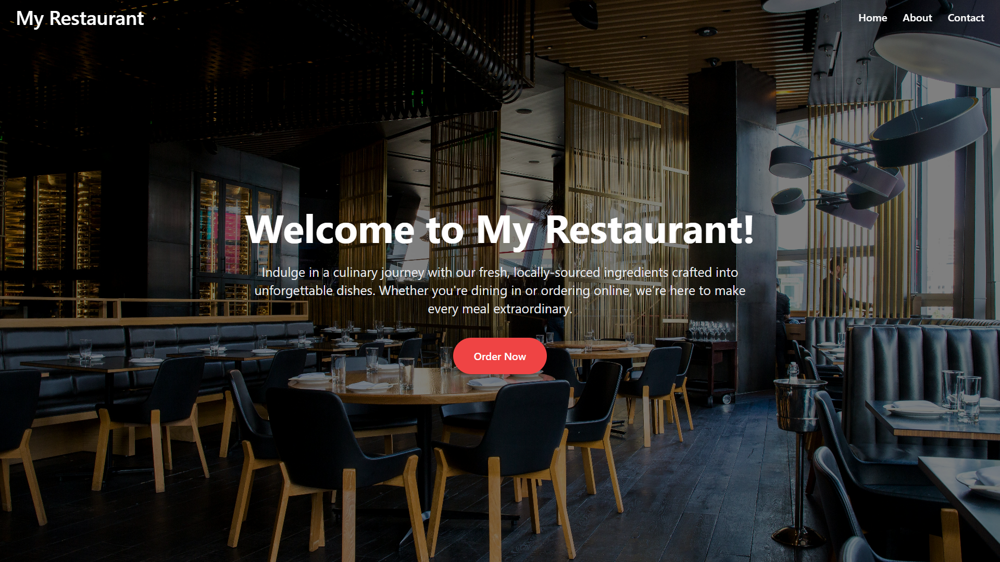
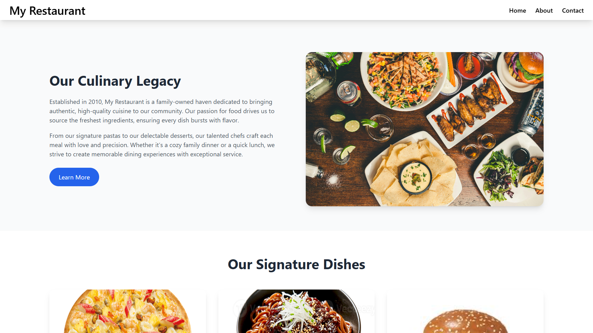
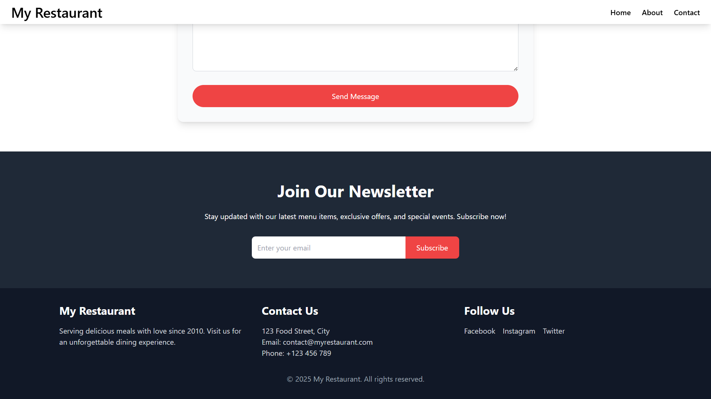
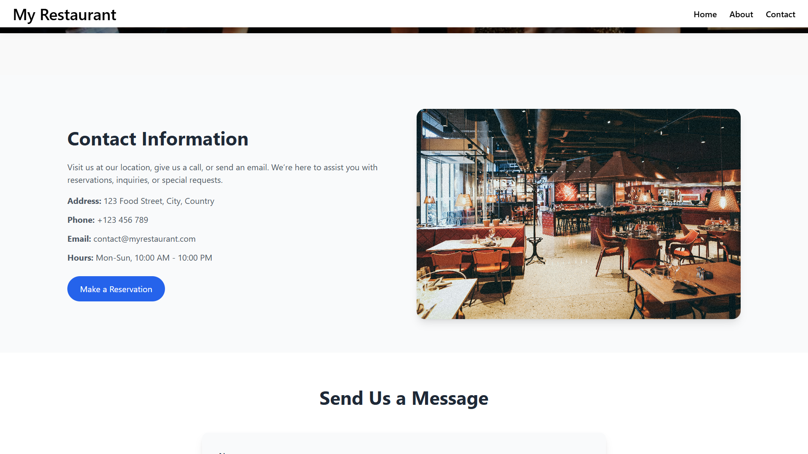

### Order UI - Desktop

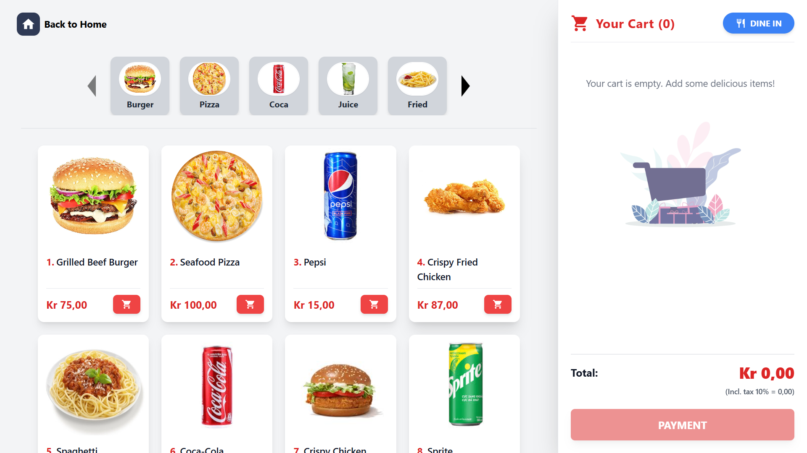
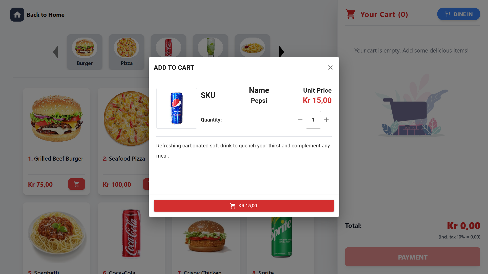
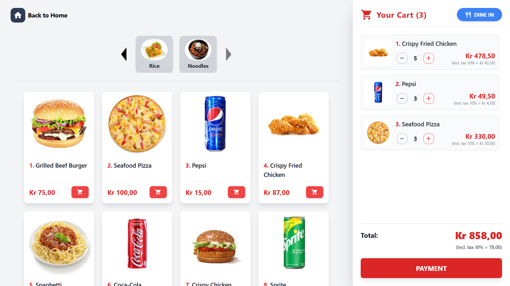

### Responsive Phone

| 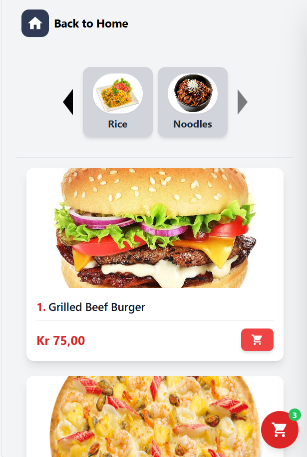 | 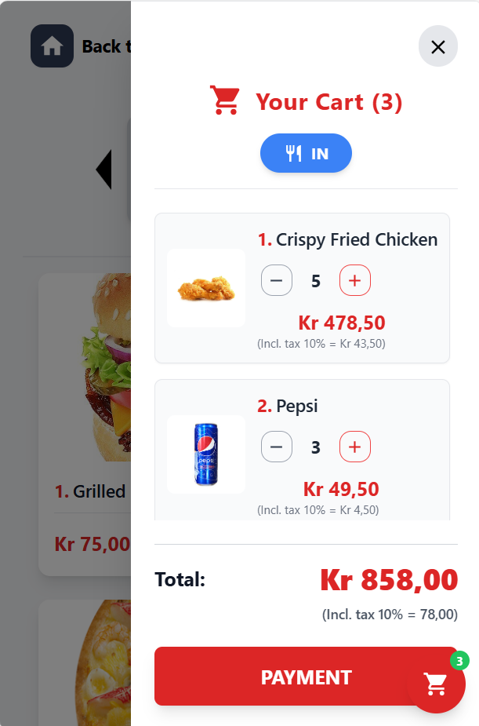 |
| --------------------------------------------- | --------------------------------------------- |

### QR Code


### Payment, Invoice & Feedback

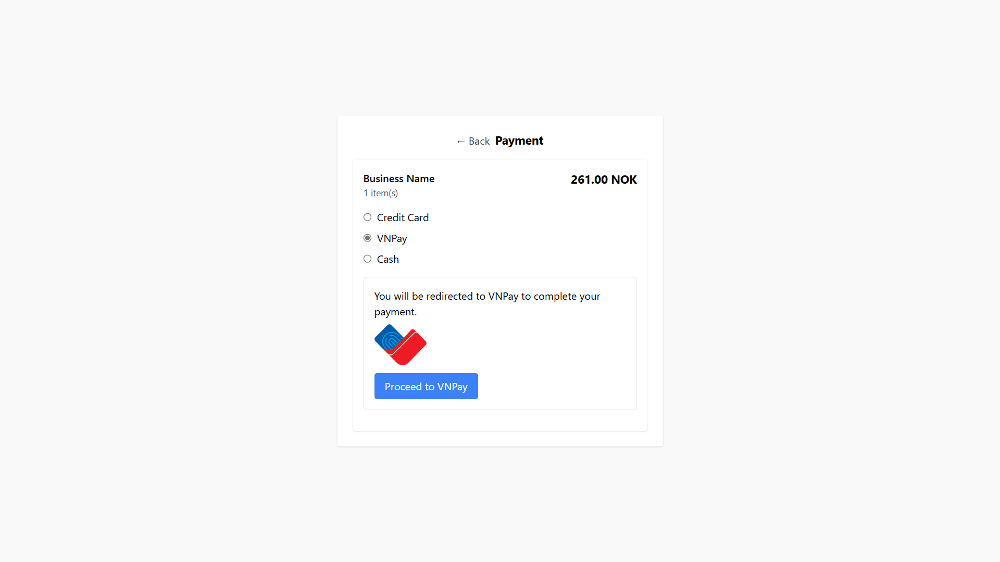
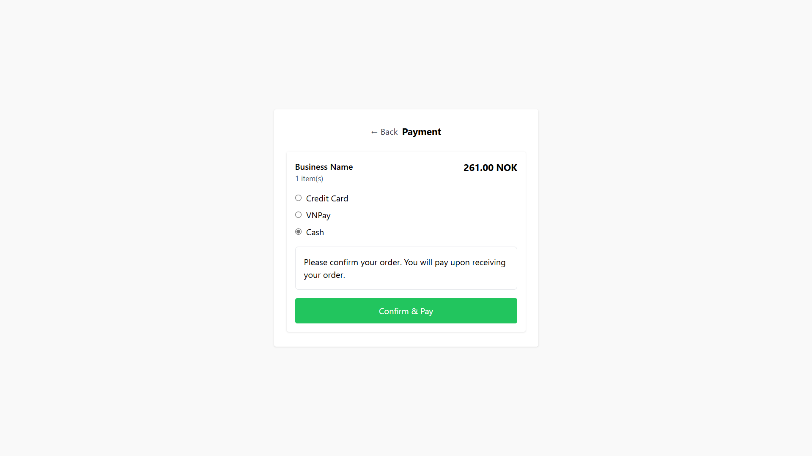
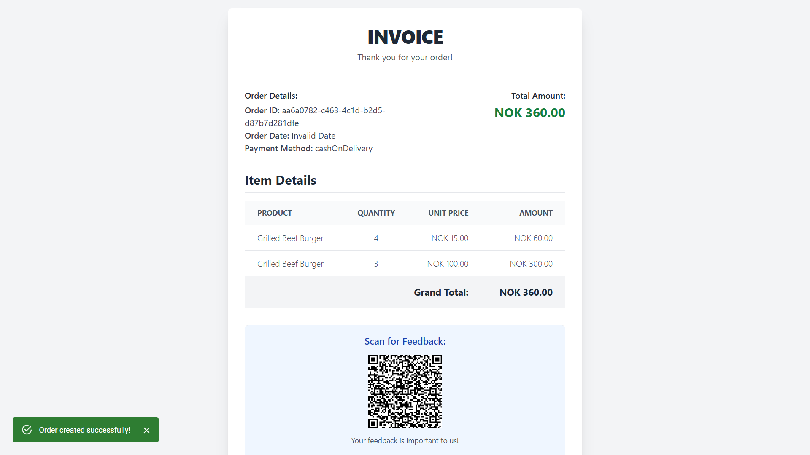
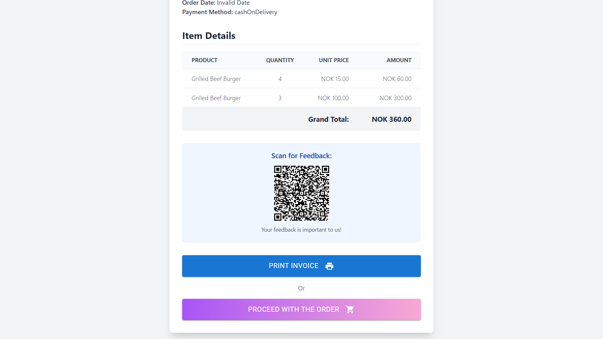
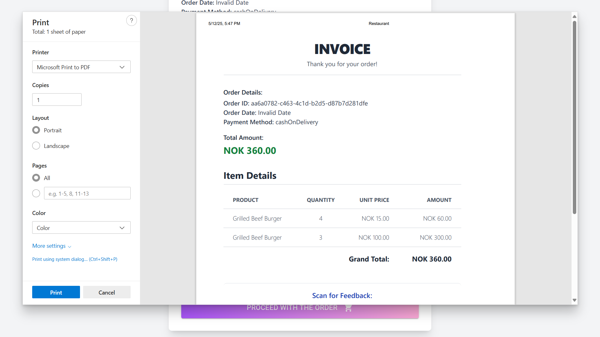
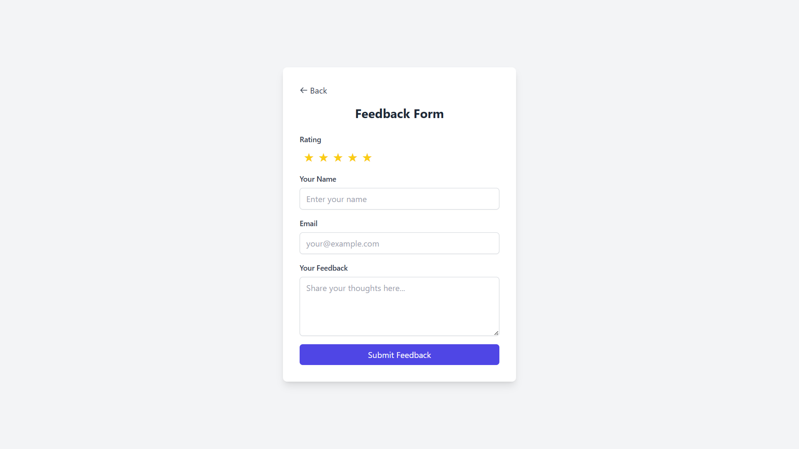
